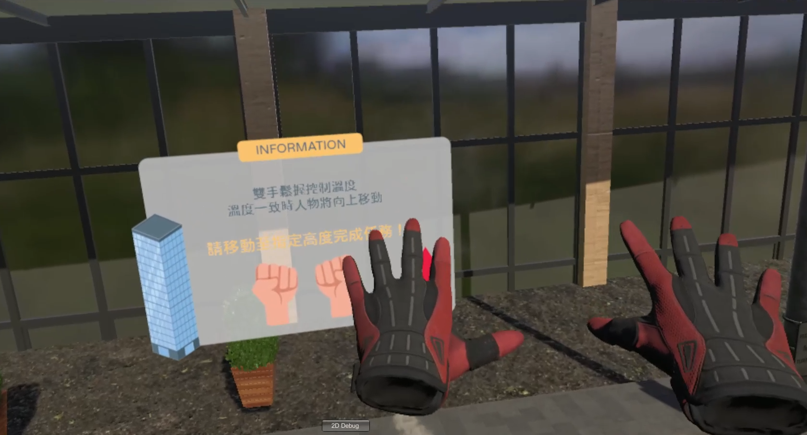
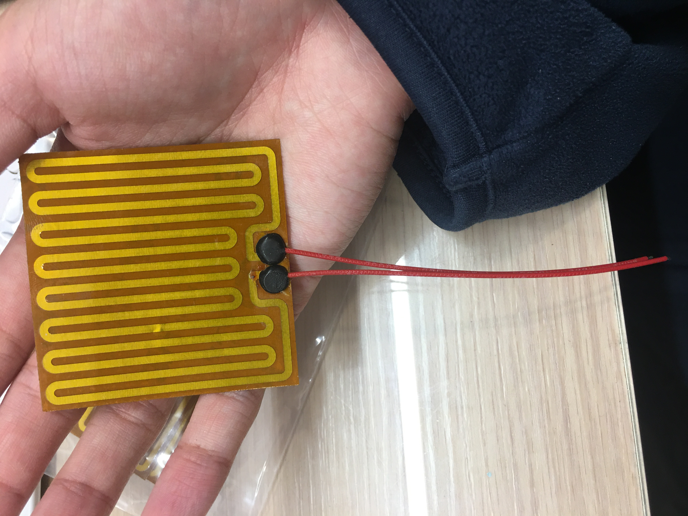
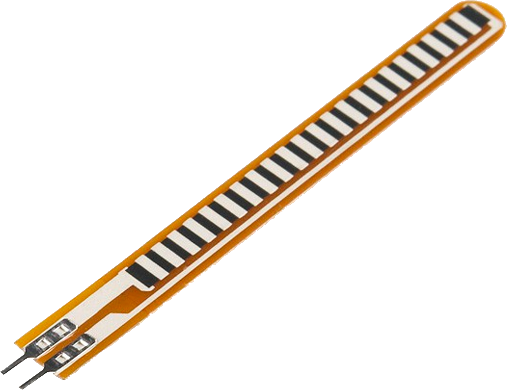
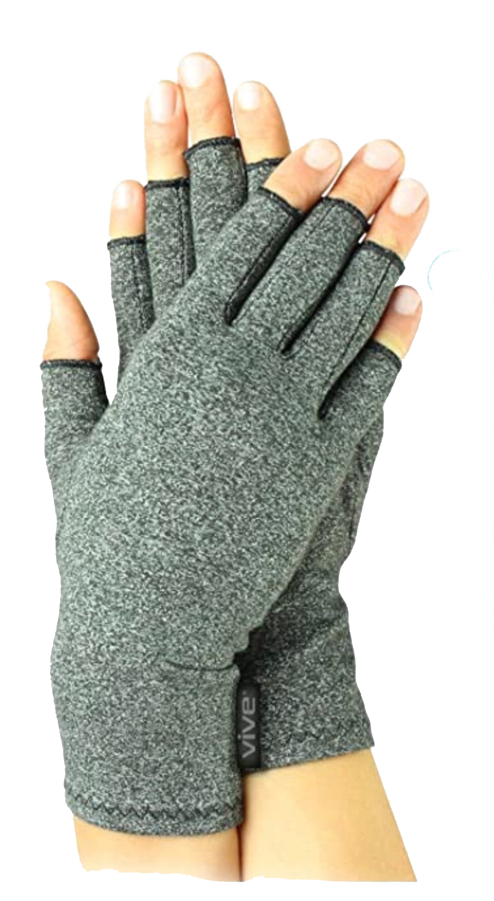
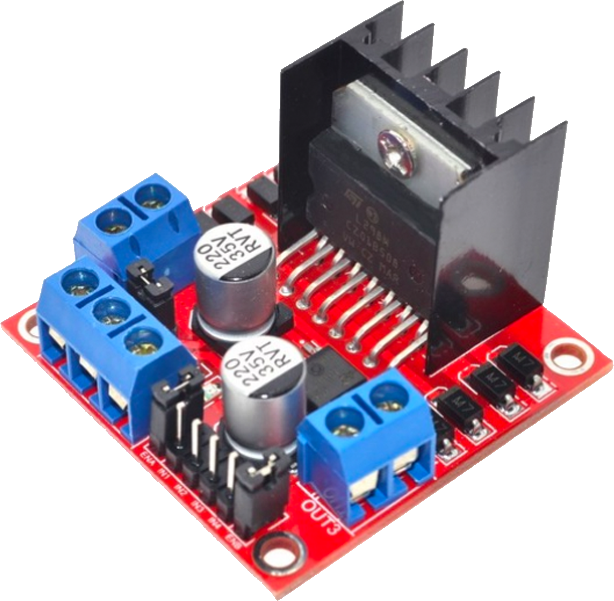
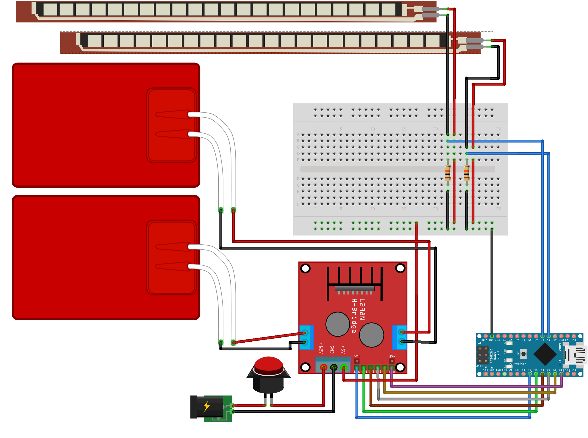

# 虛擬實境中聲音對熱觸覺回饋影響之研究
### Research on the Influence of Sound upon Thermal Perception in Virtual Reality

 

## 介紹 Introduct

* 在VR遊戲中，透過多模態感知刺激(Cross-model correspondence)，藉由聲音來影響人對於熱觸覺的感知。
* 硬體裝置包含一副搭載發熱貼片、彎曲感測器及 HTC VIVE 移動定位器的手套、頭戴式顯示器與耳機。
* 可以根據受測者的手掌彎曲幅度， 調整發熱貼片之溫度及輸出音量之大小。
* 玩家要在虛擬實境遊戲中，正確地調控裝置溫度來操縱遊戲中人物手掌的噴射火焰大小，移動至終點。

 

硬體使用-`Arduino nano`做開發。  
軟體使用-`Unity`、`Arduino IDE`進行遊戲開發與裝置控制，最後將兩者結合。

 

## 目錄 Table of content
* [遊戲內容](#遊戲內容-Game-Design)
* [裝置設計](#裝置設計-Device-Design)
  * 使用元件
  * 裝置架構
  * 電路設計
  * 裝置製作
* [遊戲設計](#程式設計-Programming)
  * 系統關係圖 System Context Diagram
  * Unity與Arduino串接
  * 遊戲功能設定
  * 遊玩流程

 

## 遊戲內容 Game Design
此遊戲主要想藉由「***音量的漸增***」與「***溫度的提升***」所產生之跨模態效應，來強化受測者在虛擬實境中對於熱觸覺的感知。 
* 情境設定：玩家必須使用雙手控制手中之噴射火焰，飛至終點線 以完成任務。
* 功能設定：只有當雙手溫度一致時，玩家才會向上飛， 系統會自動判斷雙手溫度是否一致，若溫度一致之狀態維持超過3秒，則人物向上飛，過程中，雙手溫度一致之狀態只要一中斷，玩家將會立即停止向上移動。 
* 遊戲影片：點擊圖片觀看影片！ 
  

 

## 裝置設計 Device Design
* **使用元件**
  * 電熱片
    > 電熱片為 60*60mm/17歐姆之電熱片，厚度約為 0.25mm，能夠貼合於掌心且能彎曲，用於熱觸覺回饋。     
  * 彎曲感測器Flex Sensor SpectraSymbol 2.2′′
    > 用於測量手掌的彎曲幅度。   
  * 關節炎壓縮手套
    >   
  * Arduino Nano 開發板
    >   
  * L298N 直流驅動電路
    > 因**Arduino Nano本身之電壓不足以供應兩片電熱片所需**，故改以L298N直流驅動電路進行電壓的分配，而Arduino Nano則進行L298N上的邏輯控制。電源輸入使用24伏特/1安培的直流變壓器進行供電。  
   
  
* **裝置架構**  
 

* **電路設計**
 
  
 

* **裝置製作**
 
  
 

## 程式設計 Programming

 

